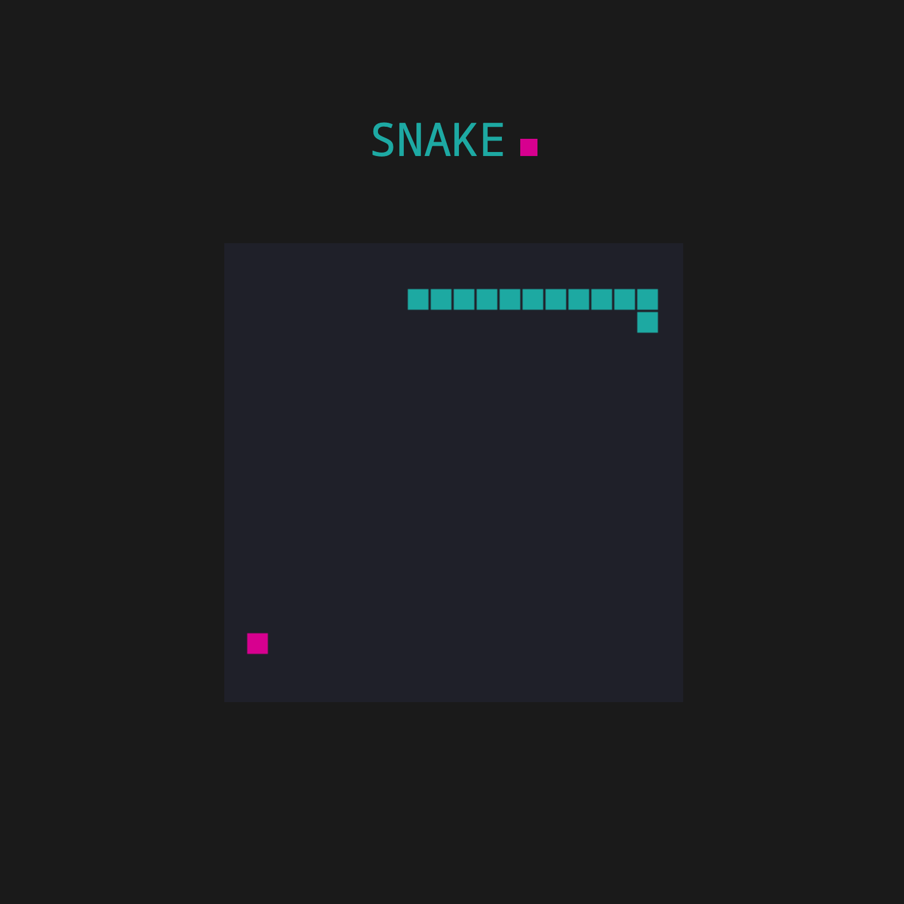

# Snake Game
> This is a simple snake game. Written in vanilla JavaScript, HTML and CSS. 

## General Info
The goal of this project is to show that I am familiar with the use of the basics of the canvas and make simple animation loop in it.

## Technologies
- HTML
- Canvas
- CSS
- JavaScript

## Screenshots

## Usage
Download all files or clone repository to your local machine and open `index.html` 

## Inspirations
This project was inspired by video [Coding Challenge #3: The Snake Game](https://www.youtube.com/watch?v=AaGK-fj-BAM&t=904s) by Daniel Schiffman from The Coding Train.